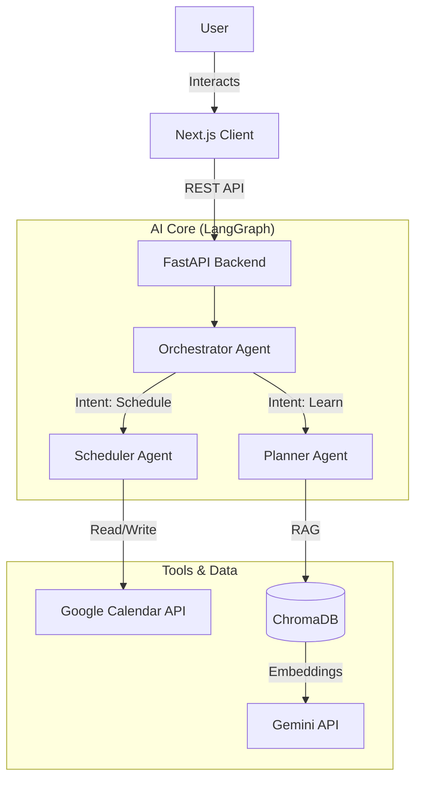

# 🛡️ Aegis LifeOS

> **Your AI-Powered Personal Orchestrator.**
> *Plan your life, master new skills, and manage your schedule—all with the power of Agentic AI.*


## 📖 Overview

**Aegis LifeOS** is an intelligent agentic application designed to help users reclaim their time. Unlike standard to-do lists, Aegis actively **plans** for you. It uses a multi-agent system to analyze your goals (like "Learn Python"), breaks them down into actionable roadmaps, and cross-references your **Google Calendar** to find the perfect time slots—automatically.

Built with a modern **Next.js** frontend and a robust **FastAPI** backend, it leverages **LangGraph** for stateful agent orchestration and **LlamaIndex** for RAG (Retrieval-Augmented Generation) capabilities.

## ✨ Key Features

- **🤖 Multi-Agent Orchestration**: Powered by `LangGraph`, specialized agents (Planner, Scheduler, Orchestrator) work together to solve complex user requests.
- **📅 Smart Scheduling**: seamless integration with Google Calendar to detect conflicts and book sessions without double-booking.
- **📚 Intelligent Learning Plans**: Generates personalized curriculum roadmaps and automatically schedules study sessions based on your availability.
- **🧠 RAG-Powered Knowledge**: Upload PDFs to your personal knowledge base. The system indexes them using **ChromaDB** and **Gemini** embeddings to answer queries with context.
- **💬 Interactive Chat UI**: A beautiful, responsive interface built with **TailwindCSS** and **Framer Motion**, featuring real-time "thinking" indicators and rich proposal cards.

## 🏗️ Architecture

Aegis uses a micro-service architecture with a clear separation of concerns between the frontend client and the AI-powered backend.



## 🛠️ Tech Stack

### Frontend
- **Framework**: Next.js 15 (App Router)
- **Language**: TypeScript
- **Styling**: TailwindCSS, Shadcn UI
- **Animations**: Framer Motion
- **State/Icons**: Lucide React

### Backend
- **Framework**: FastAPI
- **Language**: Python 3.13
- **AI Orchestration**: LangGraph, LangChain
- **RAG & Data**: LlamaIndex, ChromaDB
- **LLM**: Google Gemini Pro

## 🚀 Getting Started

### Prerequisites
- Node.js 18+
- Python 3.10+
- Google Cloud Console Project (for OAuth & Calendar API)
- Gemini API Key

### Installation

1. **Clone the repository**
   ```bash
   git clone https://github.com/noahnghg/Aegis.git
   cd Aegis
   ```

2. **Backend Setup**
   ```bash
   cd backend
   python -m venv venv
   source venv/bin/activate  # or venv\Scripts\activate on Windows
   pip install -r requirements.txt
   ```
   Create a `.env` file in `backend/`:
   ```env
   GEMINI_API_KEY=your_key_here
   ```

3. **Frontend Setup**
   ```bash
   cd ../client
   npm install
   ```

4. **Run the Application**
   *Terminal 1 (Backend):*
   ```bash
   cd backend
   uvicorn app.main:app --reload
   ```
   *Terminal 2 (Frontend):*
   ```bash
   cd client
   npm run dev
   ```

Open [http://localhost:3000](http://localhost:3000) to start using Aegis LifeOS!

## 🔮 Future Roadmap

- [ ] **Voice Interface**: Talk to Aegis directly for hands-free planning.
- [ ] **Multi-User Support**: Team scheduling and shared knowledge bases.
- [ ] **Notion Integration**: Sync learning plans directly to Notion pages.

---
*Built with ❤️ by Noah.*
