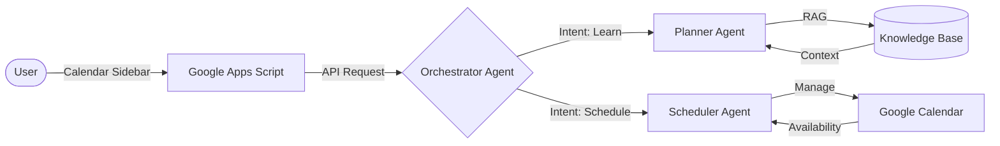

# Aegis LifeOS — Google Calendar AI Add-on

Aegis LifeOS is an AI-powered Google Calendar sidebar add-on that plans and schedules learning goals directly into your calendar. It uses a multi-agent architecture to understand your intent, generate detailed learning roadmaps, detect scheduling conflicts, and book sessions — all from a panel inside Google Calendar.

## Key Features

- **Google Calendar Sidebar** — interact with Aegis without leaving your calendar
- **Multi-Agent Orchestration** — specialized agents for planning, scheduling, and coordination
- **Smart Scheduling** — detects conflicts and books study sessions automatically
- **Learning Roadmaps** — generates multi-week curricula for any topic
- **Human-in-the-Loop** — approve, revise, or reject plans before they hit your calendar
- **Knowledge Base** — upload PDFs so the AI can answer questions from your documents

## Architecture


```mermaid
graph LR
    User([User]) -->|Calendar Sidebar| GAS[Google Apps Script]
    GAS -->|API Request| Orchestrator{Orchestrator Agent}
    
    Orchestrator -->|Intent: Learn| Planner[Planner Agent]
    Orchestrator -->|Intent: Schedule| Scheduler[Scheduler Agent]
    
    Planner -->|RAG| KB[(Knowledge Base)]
    Scheduler -->|Manage| GCal[Google Calendar]
    
    KB -->|Context| Planner
    GCal -->|Availability| Scheduler
```

| Component | Tech |
|---|---|
| **Frontend** | Google Apps Script (Calendar sidebar card UI) |
| **Backend** | FastAPI · Python 3.10+ |
| **AI** | Google Gemini · LangGraph · LlamaIndex |
| **Auth** | Google OAuth 2.0 via Calendar API |

## Getting Started

### Prerequisites

- Python 3.10+
- A Google Cloud Console project with the **Google Calendar API** enabled
- A Google Gemini API key

### 1. Clone the Repo

```bash
git clone https://github.com/noahnghg/Aegis.git
cd Aegis
```

### 2. Backend Setup

```bash
cd backend
python -m venv .venv
source .venv/bin/activate   # Windows: .venv\Scripts\activate
pip install -r requirements.txt
```

Create a `.env` file in `backend/`:

```env
GEMINI_API_KEY=your_key_here
```

### 3. Google Cloud Setup

1. Go to the [Google Cloud Console](https://console.cloud.google.com/).
2. Create or select a project.
3. Enable the **Google Calendar API**.
4. Configure the **OAuth Consent Screen** (External or Internal).
5. Create **OAuth Client ID** credentials (Application type: **Desktop App**).
6. Download the JSON file and save it as `credentials.json` inside `backend/`.

### 4. Run the Backend

```bash
cd backend
uvicorn app.main:app --reload
```

The API will be available at `http://localhost:8000`.

> **Note:** For the Google Apps Script add-on to reach your local backend, you must expose it via a tunnel like [ngrok](https://ngrok.com/):
> ```bash
> ngrok http 8000
> ```
> Copy the generated `https://...ngrok-free.app` URL — you will need it in the next step.

### 5. Deploy the Google Apps Script Add-on

1. Go to [script.google.com](https://script.google.com) → **New Project**.
2. Rename the project to **Aegis LifeOS**.
3. Replace the contents of `Code.gs` with the file from `google_apps_script/Code.gs`.
4. Update the `BASE_URL` variable at the top of `Code.gs` with your backend URL (ngrok or production).
5. In the editor sidebar, click the gear icon (**Project Settings**):
   - Enable **Show "appsscript.json" manifest file in editor**.
6. Open `appsscript.json` in the editor and replace its contents with `google_apps_script/appsscript.json`.
7. Click **Deploy** → **Test deployments** → select **Google Workspace Add-on** → **Install**.
8. Open [Google Calendar](https://calendar.google.com). Click the **Aegis LifeOS** icon in the right sidebar.

## Usage

| Action | What Happens |
|---|---|
| **Ask Aegis** | Type a prompt like _"Plan learning Python in 4 weeks"_ → get a roadmap → approve or revise |
| **Check Schedule** | Scans the next hour for conflicts and suggests open slots |
| **Upload PDF** | Opens the FastAPI Swagger UI to upload documents for the knowledge base |

## Project Structure

```
Aegis/
├── backend/
│   ├── app/
│   │   ├── agents/        # Orchestrator, Planner, Scheduler agents
│   │   ├── core/          # Ingestion, RAG, config
│   │   ├── tools/         # Google Calendar tool
│   │   └── main.py        # FastAPI entrypoint
│   └── requirements.txt
├── google_apps_script/
│   ├── Code.gs            # Add-on UI and API calls
│   └── appsscript.json    # Manifest with scopes and triggers
└── README.md
```

## License

MIT
